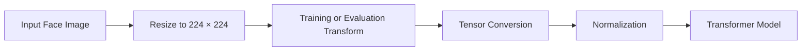
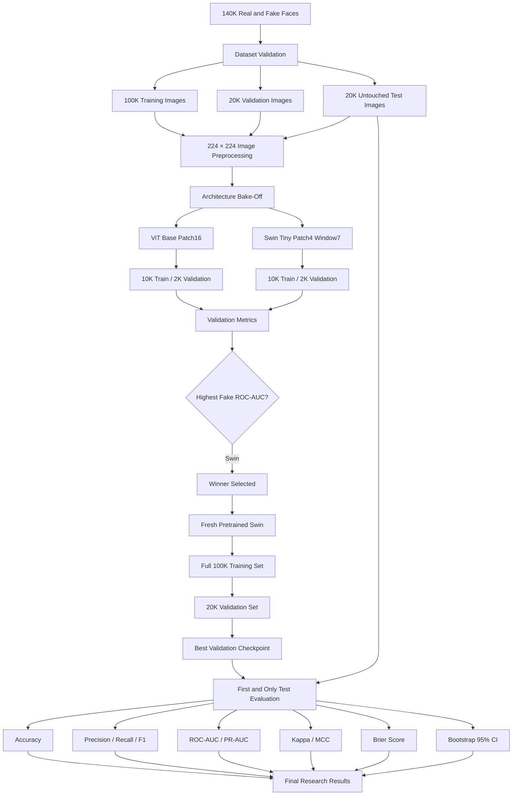
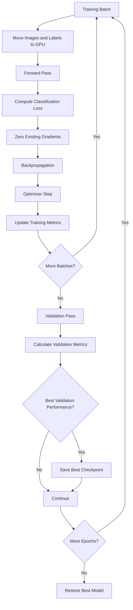

<div align="center">


<br/>


<br/><br/>


</div>

---

## ✨ Project Overview

**Deepfake Detection Using ViT and Swin Transformers** is a deep learning research project for distinguishing **real facial images from GAN-generated facial images**.

The project performs a controlled experimental pipeline using two pretrained transformer-based computer vision architectures:

* **Vision Transformer (ViT)**
* **Swin Transformer**

Both models were first evaluated through an architecture bake-off using the same training and validation subset sizes. The winning architecture was selected using **fake-class validation ROC-AUC** without accessing the test set.

The winning **Swin Transformer** was then reinitialized from its original pretrained weights and trained from scratch on the full training dataset.

The final model was evaluated exactly once on the untouched 20,000-image test set and achieved:

<div align="center">


</div>

The experiment was designed not only to measure classification accuracy, but also to evaluate **sensitivity, specificity, calibration, ranking performance, class agreement, confidence intervals, and error behavior**.

---

## 🎯 Primary Objectives

* Detect GAN-generated facial images using deep learning
* Compare ViT and Swin Transformer architectures
* Use pretrained transformer-based visual representations
* Select a winning architecture without test-set leakage
* Treat the fake class as the positive forensic class
* Train the winning architecture on the complete training dataset
* Evaluate performance on a fully untouched test set
* Measure performance using more than accuracy alone
* Report precision, recall, specificity, F1-score, ROC-AUC, PR-AUC, MCC, and Cohen's Kappa
* Evaluate probability calibration using the Brier score
* Calculate bootstrap 95% confidence intervals
* Visualize prediction behavior and misclassification patterns
* Save the final trained model and reproducible experiment outputs
* Maintain a scientifically accurate scope for the reported findings

---

## 🏆 Final Result

The architecture comparison selected **Swin Transformer** as the winning model.

### Final Model

```text
Architecture:
Swin Transformer

Checkpoint:
swin_tiny_patch4_window7_224.ms_in1k

Input Resolution:
224 × 224

Positive Forensic Class:
Fake

Final Test Images:
20,000
```

### Final Untouched Test Performance

| Metric                               |       Result |
| ------------------------------------ | -----------: |
| **Accuracy**                         | **0.992800** |
| **Balanced Accuracy**                | **0.992800** |
| **Fake Precision**                   | **0.989569** |
| **Fake Recall / Sensitivity**        | **0.996100** |
| **Real Specificity**                 | **0.989500** |
| **Fake F1-Score**                    | **0.992824** |
| **Fake ROC-AUC**                     | **0.999774** |
| **Fake PR-AUC**                      | **0.999773** |
| **Cohen's Kappa**                    | **0.985600** |
| **Matthews Correlation Coefficient** | **0.985621** |
| **Brier Score**                      | **0.006207** |

<div align="center">

### Final Test Accuracy: **99.28%**

### Fake Detection Sensitivity: **99.61%**

### ROC-AUC: **99.9774%**

</div>

---

## 🚦 Research Status

<div align="center">


</div>

| Research Stage                 | Status     |
| ------------------------------ | ---------- |
| Dependency verification        | ✅ Complete |
| GPU configuration              | ✅ Complete |
| Dataset discovery              | ✅ Complete |
| Dataset integrity checks       | ✅ Complete |
| Image preprocessing            | ✅ Complete |
| ViT initialization             | ✅ Complete |
| Swin initialization            | ✅ Complete |
| Architecture bake-off          | ✅ Complete |
| Winner selection               | ✅ Complete |
| Full winner training           | ✅ Complete |
| Untouched test evaluation      | ✅ Complete |
| Classification report          | ✅ Complete |
| ROC analysis                   | ✅ Complete |
| Precision-recall analysis      | ✅ Complete |
| Calibration analysis           | ✅ Complete |
| Error visualization            | ✅ Complete |
| Bootstrap confidence intervals | ✅ Complete |
| Final model export             | ✅ Complete |
| Research report generation     | ✅ Complete |
| Complete experiment archive    | ✅ Complete |

---

## 📚 Dataset

The experiment uses the **140K Real and Fake Faces** dataset.

```text
Dataset:
140k Real and Fake Faces

Dataset Location:
/kaggle/input/datasets/xhlulu/140k-real-and-fake-faces/
real_vs_fake/real-vs-fake
```

### Dataset Distribution

| Split      |       Fake |       Real |       Total |
| ---------- | ---------: | ---------: | ----------: |
| Training   |     50,000 |     50,000 | **100,000** |
| Validation |     10,000 |     10,000 |  **20,000** |
| Test       |     10,000 |     10,000 |  **20,000** |
| **Total**  | **70,000** | **70,000** | **140,000** |

The dataset is perfectly balanced across the two classes.

### Class Mapping

```python
{
    "fake": 0,
    "real": 1
}
```

Therefore:

```text
FAKE_ID = 0
REAL_ID = 1

Positive forensic class = FAKE
```

This mapping is important because the reported sensitivity, precision, F1-score, ROC-AUC, and PR-AUC values use **fake** as the positive class.

---

## 📁 Dataset Structure

```text
real-vs-fake/
│
├── train/
│   ├── fake/      # 50,000 images
│   └── real/      # 50,000 images
│
├── valid/
│   ├── fake/      # 10,000 images
│   └── real/      # 10,000 images
│
└── test/
    ├── fake/      # 10,000 images
    └── real/      # 10,000 images
```

---

## 🖼 Image Preprocessing

All images are processed at:

```text
224 × 224 pixels
```

The preprocessing pipeline prepares each image for the pretrained transformer backbones while separating training augmentation from validation and test preprocessing.



Training data can receive stochastic augmentation, while validation and test data use deterministic preprocessing to ensure repeatable evaluation.

---

## 🧠 Models Compared

Two pretrained transformer architectures were compared.

### Vision Transformer

```text
Model:
ViT

Checkpoint:
vit_base_patch16_224.augreg2_in21k_ft_in1k

Parameters:
85.80 million
```

### Swin Transformer

```text
Model:
Swin Transformer

Checkpoint:
swin_tiny_patch4_window7_224.ms_in1k

Parameters:
27.52 million
```

The selected configurations therefore differ in both architecture and pretrained-weight history.

This experiment should be interpreted as a comparison between the **selected pretrained ViT and Swin pipelines**, rather than a perfectly controlled architecture-only ablation.

---

## 🏗 System Architecture



---

## 🔬 Experimental Design

The research pipeline was deliberately divided into two stages.

### Stage 1: Architecture Bake-Off

A smaller subset was used to compare the candidate architectures efficiently.

```text
Training subset:
10,000 images

Validation subset:
2,000 images

Training epochs:
1 epoch per model
```

The test set was completely excluded from architecture selection.

### Stage 2: Full Winner Training

After Swin won the architecture comparison, a **fresh pretrained Swin model** was created.

Bake-off weights were **not reused**.

```text
Training images:
100,000

Validation images:
20,000

Epochs:
2

Test images:
20,000 untouched images
```

The final test evaluation occurred only after model selection and full training were completed.

---

# ⚔️ Architecture Bake-Off

## 🟣 Vision Transformer Results

### Configuration

```text
Checkpoint:
vit_base_patch16_224.augreg2_in21k_ft_in1k

Parameters:
85.80M

Training images:
10,000

Validation images:
2,000

Epochs:
1
```

### Results

| Metric            |      ViT |
| ----------------- | -------: |
| Train Loss        | 0.269116 |
| Validation Loss   | 0.121852 |
| Accuracy          | 0.955500 |
| Balanced Accuracy | 0.955500 |
| Fake Precision    | 0.977964 |
| Fake Recall       | 0.932000 |
| Real Specificity  | 0.979000 |
| Fake F1           | 0.954429 |
| Fake ROC-AUC      | 0.992458 |
| Fake PR-AUC       | 0.992449 |
| Cohen's Kappa     | 0.911000 |
| MCC               | 0.912008 |
| Brier Score       | 0.035432 |
| Training Time     | 1.97 min |

---

## 🔵 Swin Transformer Results

### Configuration

```text
Checkpoint:
swin_tiny_patch4_window7_224.ms_in1k

Parameters:
27.52M

Training images:
10,000

Validation images:
2,000

Epochs:
1
```

### Results

| Metric            |         Swin |
| ----------------- | -----------: |
| Train Loss        |     0.229287 |
| Validation Loss   |     0.085934 |
| Accuracy          |     0.969500 |
| Balanced Accuracy |     0.969500 |
| Fake Precision    |     0.958944 |
| Fake Recall       |     0.981000 |
| Real Specificity  |     0.958000 |
| Fake F1           |     0.969847 |
| Fake ROC-AUC      | **0.997089** |
| Fake PR-AUC       | **0.997183** |
| Cohen's Kappa     |     0.939000 |
| MCC               |     0.939248 |
| Brier Score       |     0.021871 |
| Training Time     |     1.59 min |

---

## 📊 ViT vs Swin Comparison

| Metric            |          ViT |          Swin | Better |
| ----------------- | -----------: | ------------: | ------ |
| Accuracy          |     0.955500 |  **0.969500** | Swin   |
| Balanced Accuracy |     0.955500 |  **0.969500** | Swin   |
| Fake Precision    | **0.977964** |      0.958944 | ViT    |
| Fake Recall       |     0.932000 |  **0.981000** | Swin   |
| Real Specificity  | **0.979000** |      0.958000 | ViT    |
| Fake F1           |     0.954429 |  **0.969847** | Swin   |
| Fake ROC-AUC      |     0.992458 |  **0.997089** | Swin   |
| Fake PR-AUC       |     0.992449 |  **0.997183** | Swin   |
| Cohen's Kappa     |     0.911000 |  **0.939000** | Swin   |
| MCC               |     0.912008 |  **0.939248** | Swin   |
| Training Time     |   118.01 sec | **95.11 sec** | Swin   |

### Bake-Off Summary

```text
ViT
Accuracy       ███████████████████░ 95.55%
Fake Recall    ███████████████████░ 93.20%
ROC-AUC        ████████████████████ 99.25%

Swin
Accuracy       ████████████████████ 96.95%
Fake Recall    ████████████████████ 98.10%
ROC-AUC        ████████████████████ 99.71%
```

---

## 🏆 Winner Selection

The winner was selected using:

> **Validation fake-class ROC-AUC**

This metric was chosen because ROC-AUC evaluates ranking performance across classification thresholds and is especially useful when assessing the system's ability to distinguish fake from real images.

```text
🏆 WINNING ARCHITECTURE:
Swin Transformer

Checkpoint:
swin_tiny_patch4_window7_224.ms_in1k

Validation Fake ROC-AUC:
0.997089

Test Set Used During Selection:
NO
```

---

# 🚀 Full Swin Training

The winning architecture was reinitialized using a **fresh pretrained model**.

Weights from the bake-off experiment were not reused.

## Training Configuration

```text
Architecture:
Swin Transformer

Checkpoint:
swin_tiny_patch4_window7_224.ms_in1k

Training Images:
100,000

Validation Images:
20,000

Epochs:
2
```

---

## Epoch 1

| Metric            |       Result |
| ----------------- | -----------: |
| Train Loss        |     0.078525 |
| Validation Loss   |     0.252013 |
| Accuracy          |     0.957000 |
| Balanced Accuracy |     0.957000 |
| Fake Precision    |     0.921121 |
| Fake Recall       | **0.999600** |
| Real Specificity  |     0.914400 |
| Fake F1           |     0.958757 |
| Fake ROC-AUC      |     0.998723 |
| Fake PR-AUC       |     0.998342 |
| Cohen's Kappa     |     0.914000 |
| MCC               |     0.917336 |

---

## Epoch 2

| Metric            |       Result |
| ----------------- | -----------: |
| Train Loss        | **0.033615** |
| Validation Loss   | **0.026148** |
| Accuracy          | **0.993000** |
| Balanced Accuracy | **0.993000** |
| Fake Precision    | **0.989476** |
| Fake Recall       | **0.996600** |
| Real Specificity  | **0.989400** |
| Fake F1           | **0.993025** |
| Fake ROC-AUC      | **0.999811** |
| Fake PR-AUC       | **0.999812** |
| Cohen's Kappa     | **0.986000** |
| MCC               | **0.986026** |

---

## 🥇 Best Validation Performance

```text
Accuracy:
99.3000%

Balanced Accuracy:
99.3000%

Fake Precision:
98.9476%

Fake Recall:
99.6600%

Real Specificity:
98.9400%

Fake F1:
99.3025%

Fake ROC-AUC:
99.9811%

Fake PR-AUC:
99.9812%

Cohen Kappa:
0.986000

MCC:
0.986026

Brier Score:
0.006095

Total Full Training Time:
30.98 minutes
```

---

# 🧪 Final Untouched Test Evaluation

The final test evaluation was performed **only after architecture selection and full model training were complete**.

```text
This was the FIRST evaluation on the test set.

Test images:
20,000
```

This separation reduces the risk of test-set leakage during model selection.

---

## 📊 Final Test Results

| Metric                        |        Score |   Percentage |
| ----------------------------- | -----------: | -----------: |
| **Accuracy**                  | **0.992800** | **99.2800%** |
| **Balanced Accuracy**         | **0.992800** | **99.2800%** |
| **Fake Precision**            | **0.989569** | **98.9569%** |
| **Fake Recall / Sensitivity** | **0.996100** | **99.6100%** |
| **Real Specificity**          | **0.989500** | **98.9500%** |
| **Fake F1**                   | **0.992824** | **99.2824%** |
| **Fake ROC-AUC**              | **0.999774** | **99.9774%** |
| **Fake PR-AUC**               | **0.999773** | **99.9773%** |
| **Cohen's Kappa**             | **0.985600** |            — |
| **MCC**                       | **0.985621** |            — |
| **Brier Score**               | **0.006207** |            — |

---

## 📑 Final Classification Report

| Class            | Precision |   Recall |     F1-Score |    Support |
| ---------------- | --------: | -------: | -----------: | ---------: |
| Fake             |  0.989569 | 0.996100 |     0.992824 |     10,000 |
| Real             |  0.996074 | 0.989500 |     0.992776 |     10,000 |
| **Accuracy**     |           |          | **0.992800** | **20,000** |
| Macro Average    |  0.992821 | 0.992800 |     0.992800 |     20,000 |
| Weighted Average |  0.992821 | 0.992800 |     0.992800 |     20,000 |

---

## 🔢 Approximate Error Distribution

From the reported class-level recall and specificity:

```text
Actual Fake Images:
10,000

Correctly Detected Fake:
9,961

Fake Classified as Real:
39


Actual Real Images:
10,000

Correctly Detected Real:
9,895

Real Classified as Fake:
105
```

Therefore:

```text
Correct Predictions:
19,856

Incorrect Predictions:
144

Total Predictions:
20,000
```

This corresponds to the reported:

```text
Accuracy = 19,856 / 20,000 = 99.28%
```

---

## 📈 Bootstrap 95% Confidence Intervals

The final metrics were further analyzed using **500 bootstrap resamples**.

| Metric       | Point Estimate | 95% CI Lower | 95% CI Upper |
| ------------ | -------------: | -----------: | -----------: |
| Accuracy     |       0.992800 |     0.991700 |     0.993876 |
| Fake F1      |       0.992824 |     0.991739 |     0.993923 |
| Fake ROC-AUC |       0.999774 |     0.999697 |     0.999843 |
| MCC          |       0.985621 |     0.983432 |     0.987776 |

### Accuracy Interpretation

The bootstrap analysis estimates the model's test accuracy at:

```text
99.28%

95% Confidence Interval:
99.17% – 99.3876%
```

The narrow interval indicates stable performance under resampling of this test dataset.

---

## 📐 Evaluation Metrics

The project intentionally uses multiple metrics because accuracy alone does not fully describe forensic classification performance.

### Accuracy

Measures the proportion of all correctly classified images.

```text
Accuracy =
Correct Predictions
────────────────────
Total Predictions
```

### Balanced Accuracy

Calculates the average sensitivity across classes and is useful for checking whether performance is balanced.

### Fake Precision

Measures how frequently images predicted as fake were actually fake.

```text
Precision =
True Positives
────────────────────────
True Positives + False Positives
```

### Fake Recall / Sensitivity

Measures the proportion of actual fake images correctly detected.

```text
Recall =
True Positives
────────────────────────
True Positives + False Negatives
```

### Real Specificity

Measures the proportion of real images correctly recognized as real.

```text
Specificity =
True Negatives
────────────────────────
True Negatives + False Positives
```

### F1-Score

Combines precision and recall using their harmonic mean.

### ROC-AUC

Measures the model's ability to rank fake images above real images across decision thresholds.

### PR-AUC

Summarizes the precision-recall relationship across thresholds.

### Cohen's Kappa

Measures agreement between predicted and true classes while adjusting for agreement expected by chance.

### Matthews Correlation Coefficient

Provides a balanced summary of binary classification quality based on all four confusion-matrix components.

### Brier Score

Measures the quality and calibration of predicted probabilities.

Lower Brier scores indicate better probability estimates.

---

## 🔍 Why Swin Performed Better

The experiment does not establish a universal architectural superiority of Swin over ViT.

However, under this particular dataset, pretrained model configuration, training protocol, and evaluation setup, Swin achieved:

* Higher bake-off accuracy
* Higher balanced accuracy
* Higher fake recall
* Higher fake F1
* Higher ROC-AUC
* Higher PR-AUC
* Higher Cohen's Kappa
* Higher MCC
* Lower training time
* Fewer parameters

ViT achieved slightly higher fake precision and real specificity during the one-epoch bake-off.

The final architecture decision was based specifically on **validation fake-class ROC-AUC**.

---

## 🧠 Why Swin Transformer?

Swin Transformer uses hierarchical visual representations and shifted-window self-attention.

Conceptually:

```text
Input Image
     │
     ▼
Patch Partition
     │
     ▼
Local Window Attention
     │
     ▼
Shifted Window Attention
     │
     ▼
Hierarchical Feature Maps
     │
     ▼
Global Representation
     │
     ▼
Classification Head
     │
     ├──────────────┐
     ▼              ▼
   FAKE            REAL
```

The architecture provides local attention computation while progressively building larger-scale representations.

---

## ⚙️ Training Workflow



---

## 🖥 Experimental Hardware

The experiment was run in a Kaggle GPU environment.

```text
Python:
3.12.13

PyTorch:
2.10.0+cu128

timm:
1.0.26

CUDA Available:
True

Visible GPUs:
2

GPU 0:
Tesla T4

GPU 1:
Tesla T4

Training Device:
cuda:0

Training Configuration:
Single GPU

Random Seed:
42
```

Although two Tesla T4 GPUs were visible, **single-GPU training** was intentionally used.

---

## 🛠 Technology Stack

<div align="center">


</div>

| Layer                 | Technology      |
| --------------------- | --------------- |
| Programming Language  | Python          |
| Deep Learning         | PyTorch         |
| Model Library         | timm            |
| Vision Utilities      | Torchvision     |
| Image Processing      | Pillow          |
| Numerical Computing   | NumPy           |
| Data Processing       | Pandas          |
| Evaluation Metrics    | scikit-learn    |
| Visualization         | Matplotlib      |
| Progress Monitoring   | tqdm            |
| Hardware Acceleration | CUDA            |
| GPU                   | NVIDIA Tesla T4 |
| Experiment Platform   | Kaggle          |
| Version Control       | Git             |
| Repository Hosting    | GitHub          |

---

## 🧩 Research Pipeline

```text
Deepfake / GAN Face Detection Research
│
├── Environment Configuration
│   ├── Dependency verification
│   ├── Seed configuration
│   ├── CUDA verification
│   └── GPU selection
│
├── Dataset Pipeline
│   ├── Dataset discovery
│   ├── Dataset validation
│   ├── Distribution checks
│   ├── Class mapping
│   └── Image preprocessing
│
├── Architecture Bake-Off
│   ├── Vision Transformer
│   │   ├── Model initialization
│   │   ├── Parameter analysis
│   │   ├── Training
│   │   ├── Validation
│   │   └── Evaluation
│   │
│   └── Swin Transformer
│       ├── Model initialization
│       ├── Parameter analysis
│       ├── Training
│       ├── Validation
│       └── Evaluation
│
├── Architecture Comparison
│   ├── Accuracy comparison
│   ├── Recall comparison
│   ├── F1 comparison
│   ├── ROC comparison
│   ├── PR comparison
│   ├── Training-time comparison
│   ├── Parameter comparison
│   └── Radar comparison
│
├── Winner Selection
│   └── Fake-class validation ROC-AUC
│
├── Full Winner Training
│   ├── Fresh pretrained Swin
│   ├── 100K training images
│   ├── 20K validation images
│   └── Best checkpoint selection
│
├── Final Test Evaluation
│   ├── 20K untouched images
│   ├── Classification report
│   ├── Confusion matrix
│   ├── ROC curve
│   ├── Precision-recall curve
│   ├── Calibration
│   └── Probability analysis
│
├── Statistical Validation
│   └── Bootstrap 95% confidence intervals
│
└── Experiment Export
    ├── Model weights
    ├── CSV results
    ├── JSON results
    ├── Research report
    └── ZIP archive
```

---

## 📊 Generated Research Visualizations

The completed pipeline generates an extensive set of experiment outputs.

### Dataset Analysis

* Dataset distribution
* Dataset image samples

### ViT Analysis

* Parameter and model information
* Training-loss graph
* Confusion matrices
* Prediction-confidence graph
* Error examples

### Swin Analysis

* Parameter and model information
* Training-loss graph
* Confusion matrices
* Prediction-confidence graph
* Error examples

### Architecture Comparison

* ViT vs Swin metric comparison
* Training-time comparison
* Parameter-count comparison
* ROC comparison
* Precision-recall comparison
* Radar comparison

### Final Winner Analysis

* Full-training loss graph
* Winner validation graph
* Final classification report
* Final test confusion matrices
* Final test ROC curve
* Final precision-recall curve
* Probability distribution
* Calibration graph
* Test misclassification visualization
* High-confidence correct predictions
* Final metric-summary graph
* Bootstrap confidence intervals

---

## 💾 Generated Research Artifacts

The complete pipeline exports:

```text
Final model weights
Model configuration
CSV results
JSON results
Human-readable research report
Complete ZIP archive
```

### Kaggle Output Locations

```text
Main Output Directory:
/kaggle/working/vit_vs_swin_research
```

```text
Final Model:
/kaggle/working/vit_vs_swin_research/
04_Final_Winner/
FINAL_WINNER_MODEL_STATE_DICT.pt
```

```text
Master Results:
/kaggle/working/vit_vs_swin_research/
MASTER_RESULTS.csv
```

```text
Complete Archive:
/kaggle/working/
vit_vs_swin_research_complete.zip
```

---

## 📁 Recommended Repository Structure

```text
deepfake-detection/
│
├── README.md
├── LICENSE
├── requirements.txt
├── .gitignore
│
├── notebooks/
│   └── vit_vs_swin_deepfake_detection.ipynb
│
├── src/
│   ├── data/
│   │   ├── dataset.py
│   │   ├── preprocessing.py
│   │   └── transforms.py
│   │
│   ├── models/
│   │   ├── vit.py
│   │   └── swin.py
│   │
│   ├── training/
│   │   ├── train.py
│   │   ├── validate.py
│   │   └── checkpoint.py
│   │
│   ├── evaluation/
│   │   ├── metrics.py
│   │   ├── bootstrap.py
│   │   └── visualizations.py
│   │
│   └── inference/
│       └── predict.py
│
├── models/
│   └── FINAL_WINNER_MODEL_STATE_DICT.pt
│
├── results/
│   ├── MASTER_RESULTS.csv
│   ├── metrics/
│   ├── figures/
│   └── reports/
│
└── docs/
    ├── methodology.md
    ├── experiment-results.md
    └── limitations.md
```

---

## 📋 Prerequisites

Recommended requirements include:

* Python 3.10+
* PyTorch
* Torchvision
* timm
* NumPy
* Pandas
* scikit-learn
* Matplotlib
* Pillow
* tqdm

For GPU acceleration:

* NVIDIA GPU
* CUDA-compatible PyTorch installation

---

## ⚙️ Installation

Clone your repository:

```bash
git clone https://github.com/addin-alt/YOUR_REPOSITORY.git
```

Move into the repository:

```bash
cd YOUR_REPOSITORY
```

Create a virtual environment:

```bash
python -m venv .venv
```

### Linux / macOS

```bash
source .venv/bin/activate
```

### Windows

```bash
.venv\Scripts\activate
```

Install dependencies:

```bash
pip install -r requirements.txt
```

---

## 📦 Example Requirements

```text
torch
torchvision
timm
numpy
pandas
scikit-learn
matplotlib
Pillow
tqdm
```

For reproducible research, exact dependency versions should be pinned according to the experiment environment.

The recorded environment included:

```text
Python == 3.12.13
PyTorch == 2.10.0+cu128
timm == 1.0.26
```

---

## ☁️ Run on Kaggle

### 1. Create a Kaggle Notebook

Create a new notebook.

### 2. Enable GPU

Select a GPU accelerator from the notebook settings.

### 3. Attach the Dataset

Attach:

```text
140k Real and Fake Faces
```

Expected dataset root:

```text
/kaggle/input/datasets/xhlulu/140k-real-and-fake-faces/
real_vs_fake/real-vs-fake
```

### 4. Verify CUDA

```python
import torch

print("PyTorch:", torch.__version__)
print("CUDA available:", torch.cuda.is_available())

if torch.cuda.is_available():
    print("GPU:", torch.cuda.get_device_name(0))
```

### 5. Run the Notebook

The pipeline executes:

```text
Environment Setup
        ↓
Dataset Discovery
        ↓
Dataset Validation
        ↓
Image Preprocessing
        ↓
Architecture Bake-Off
        ↓
ViT Training
        ↓
Swin Training
        ↓
Architecture Comparison
        ↓
Winner Selection
        ↓
Fresh Winner Initialization
        ↓
Full Training
        ↓
Best Checkpoint
        ↓
Untouched Test Evaluation
        ↓
Statistical Validation
        ↓
Research Export
```

---

## 🔁 Reproducibility

The experiment uses:

```python
SEED = 42
```

A fixed seed improves repeatability across:

* Python random operations
* NumPy
* PyTorch
* CUDA operations where possible

Exact results may still vary slightly because GPU-based deep learning operations can contain nondeterministic components.

---

## 🧪 Experimental Integrity

Several design choices were used to strengthen the research protocol.

### Balanced Dataset

Each split contains equal numbers of fake and real images.

### Separate Validation Set

Architecture selection and checkpoint selection use validation data.

### Untouched Test Set

The test set was not used during:

* Model training
* Architecture selection
* Winner selection
* Hyperparameter comparison

### Fresh Winner Initialization

The winning Swin model was freshly initialized from pretrained weights before full training.

Bake-off weights were not reused.

### Multiple Metrics

Performance was assessed using discrimination, agreement, calibration, and classification metrics.

### Bootstrap Confidence Intervals

Final estimates were supplemented with 95% bootstrap confidence intervals.

---

## 🔬 Scientific Scope

This project evaluates:

> **Classification of real facial images versus GAN-generated facial images from the 140K Real and Fake Faces dataset under the reported experimental protocol.**

The results should therefore be described as performance on **GAN-generated face detection within this dataset and experimental setting**.

They should **not** be interpreted as proof that the model can universally detect:

* Every type of deepfake
* Face-swap manipulations
* Lip-sync manipulations
* Video deepfakes
* Diffusion-generated images
* Images from unseen GAN architectures
* Images from future generative models
* Adversarially modified synthetic media

---

## ⚠️ Limitations

Despite the high test performance, several important limitations remain.

### Dataset Dependence

Performance is measured on images from the same benchmark dataset family used for development.

### Generator Dependence

The fake images originate from the synthetic-generation process represented by the dataset.

### Unknown Generalization

The experiment does not establish performance on unseen generative models.

### Still Images Only

The current research focuses on individual facial images rather than temporal video information.

### Pretraining Differences

The ViT and Swin checkpoints differ in pretrained-weight history as well as architecture.

Therefore, the bake-off is not a perfectly isolated architecture-only experiment.

### Potential Dataset Artifacts

Deep models may learn:

* Compression characteristics
* Resolution differences
* Cropping behavior
* Background patterns
* Generator artifacts
* Frequency characteristics
* Dataset-specific image processing

These learned cues may not generalize to other sources.

---

## 🛡 Responsible Interpretation

A prediction such as:

```text
FAKE
Confidence: 99%
```

does not constitute definitive forensic proof that an image is synthetic.

A real-world media-authentication workflow should combine model predictions with additional evidence such as:

* Image provenance
* Metadata
* Source verification
* Compression analysis
* Frequency analysis
* Content provenance standards
* Human forensic review
* Cross-model verification

---

## 🚀 Future Research

### Cross-Dataset Evaluation

* Test on independent deepfake datasets
* Test GANs unseen during training
* Evaluate dataset-shift robustness

### Diffusion Model Detection

* Stable Diffusion generated faces
* DALL-E generated imagery
* Other diffusion-based generators
* Mixed GAN and diffusion training

### Explainable AI

* Grad-CAM
* Attention visualization
* Saliency maps
* Feature attribution
* Transformer attention analysis

### Robustness Analysis

* JPEG compression
* Screenshot recapture
* Image resizing
* Blurring
* Noise
* Color changes
* Social-media recompression

### Model Research

* Additional Swin variants
* DeiT
* ConvNeXt
* EfficientNet
* MaxViT
* Hybrid CNN-transformers
* Ensemble models

### Calibration

* Temperature scaling
* Reliability calibration
* Threshold selection
* Cost-sensitive inference

### Video Deepfake Detection

* Frame sampling
* Temporal modeling
* Video transformers
* Optical-flow analysis
* Frame-level aggregation

### Deployment

* FastAPI inference service
* Streamlit application
* Gradio interface
* Batch processing
* ONNX export
* TensorRT optimization
* Web-based image verification

---

## 🗺 Research Roadmap

### Phase 1: Foundation

* [x] Configure environment
* [x] Verify dependencies
* [x] Configure random seed
* [x] Detect CUDA
* [x] Configure single-GPU training

### Phase 2: Dataset

* [x] Locate the 140K dataset
* [x] Validate directory structure
* [x] Verify dataset size
* [x] Verify class distribution
* [x] Define class mapping
* [x] Configure 224 × 224 preprocessing

### Phase 3: Architecture Bake-Off

* [x] Load pretrained ViT
* [x] Load pretrained Swin
* [x] Analyze parameter counts
* [x] Train ViT subset experiment
* [x] Train Swin subset experiment
* [x] Evaluate validation metrics
* [x] Compare model performance

### Phase 4: Winner Selection

* [x] Define fake ROC-AUC selection metric
* [x] Select Swin Transformer
* [x] Confirm test set remains untouched

### Phase 5: Full Training

* [x] Initialize fresh pretrained Swin
* [x] Train on 100,000 images
* [x] Validate on 20,000 images
* [x] Save best validation checkpoint

### Phase 6: Final Evaluation

* [x] Load best model
* [x] Evaluate untouched test set
* [x] Calculate accuracy
* [x] Calculate balanced accuracy
* [x] Calculate precision
* [x] Calculate sensitivity
* [x] Calculate specificity
* [x] Calculate F1
* [x] Calculate ROC-AUC
* [x] Calculate PR-AUC
* [x] Calculate Cohen's Kappa
* [x] Calculate MCC
* [x] Calculate Brier score

### Phase 7: Research Analysis

* [x] Classification report
* [x] Confusion matrix
* [x] ROC visualization
* [x] Precision-recall visualization
* [x] Prediction-confidence analysis
* [x] Calibration analysis
* [x] Error examples
* [x] Bootstrap confidence intervals

### Phase 8: Research Expansion

* [ ] Cross-dataset testing
* [ ] Diffusion-image detection
* [ ] Grad-CAM visualization
* [ ] Compression robustness
* [ ] Unknown-generator evaluation
* [ ] Video deepfake detection
* [ ] Explainable AI experiments
* [ ] Deployment interface

---

## ✅ Research Completion Checklist

* [x] Dataset distribution documented
* [x] Dataset image samples generated
* [x] ViT model information generated
* [x] Swin model information generated
* [x] ViT training completed
* [x] Swin training completed
* [x] Architecture comparison completed
* [x] Winner selected without test leakage
* [x] Full winner training completed
* [x] Final test evaluation completed
* [x] Classification report generated
* [x] Confusion matrices generated
* [x] ROC curves generated
* [x] Precision-recall curves generated
* [x] Probability distributions generated
* [x] Calibration graph generated
* [x] Misclassifications visualized
* [x] High-confidence predictions visualized
* [x] Bootstrap confidence intervals calculated
* [x] Final model weights saved
* [x] CSV results generated
* [x] JSON results generated
* [x] Human-readable report generated
* [x] Complete archive generated

---

## 🌿 Suggested Git Branch Structure

```text
main
develop

feature/data-pipeline
feature/vit-model
feature/swin-model
feature/training-engine
feature/evaluation
feature/inference
feature/visualization

experiment/vit-vs-swin
experiment/cross-dataset
experiment/diffusion-detection
experiment/gradcam
experiment/compression-robustness

fix/dataset-loading
fix/model-checkpoint
fix/evaluation-metrics

docs/methodology
docs/results
docs/research-paper
```

---

## 🤝 Contributing

Research improvements and reproducible experiments are welcome.

Recommended workflow:

1. Create a dedicated branch.
2. Make one focused change.
3. Run the relevant tests or experiment.
4. Document changes to the methodology.
5. Commit with a descriptive message.
6. Push the branch.
7. Open a pull request.

Example:

```bash
git checkout -b experiment/cross-dataset

git add .

git commit -m "Add cross-dataset generalization experiment"

git push -u origin experiment/cross-dataset
```

When contributing new experimental results, include:

* Dataset name
* Model checkpoint
* Training configuration
* Evaluation protocol
* Random seed
* Metrics
* Hardware information
* Limitations

---

## 🎓 Academic and Research Use

This project is suitable for:

* Artificial intelligence research
* Computer vision research
* Deep learning experiments
* Synthetic media analysis
* GAN detection research
* Transformer architecture comparison
* Machine learning coursework
* Undergraduate research
* Graduate research
* Multimedia forensics experiments

When reporting the results, preserve the experimental scope and avoid describing the model as a universal deepfake detector.

---

## 📌 Citation Information

If you use this project in academic work, cite the repository and the original dataset appropriately.

Suggested repository citation format:

```text
Addin Alt.
"Deepfake Detection Using ViT and Swin Transformers:
Real vs GAN-Generated Face Classification."
GitHub Research Project.
```

Update this section with the final publication information if the project is associated with a research paper.

---

## 👨‍💻 Author

<div align="center">

### Developed by **Addin Alt**

<a href="https://github.com/addin-alt">
  
</a>

<a href="https://linkedin.com/in/addin-alt-">
  
</a>

<a href="https://facebook.com/addin.alt">
  
</a>

<a href="https://www.instagram.com/addin_alt/">
  
</a>

</div>

---

## 📄 License

This project may be distributed under the **MIT License**.

```text
MIT License
```

The dataset is not covered by the repository license and remains subject to the terms provided by its original publisher.

---

## ⭐ Support

If this research project is useful to you, consider giving the repository a star.

<div align="center">

<a href="https://github.com/addin-alt">
  
</a>

</div>

---

## ⚠️ Important Research Notice

This project achieved **99.28% accuracy and 99.9774% ROC-AUC on the untouched test split of the 140K Real and Fake Faces dataset**.

These results demonstrate strong performance under the reported experimental conditions.

They do **not** establish universal deepfake detection capability.

The model has not been shown in this experiment to reliably detect every:

* GAN architecture
* Diffusion model
* Face swap
* Video deepfake
* Lip-sync manipulation
* Social-media recompression
* Adversarial image
* Future generative model

The scientifically appropriate conclusion is:

> **The selected Swin Transformer achieved strong classification performance for distinguishing real facial images from GAN-generated facial images in the 140K Real and Fake Faces dataset under the reported training and evaluation protocol.**

---

<div align="center">

### 🏆 Final Winner: Swin Transformer


<br/><br/>


</div>
